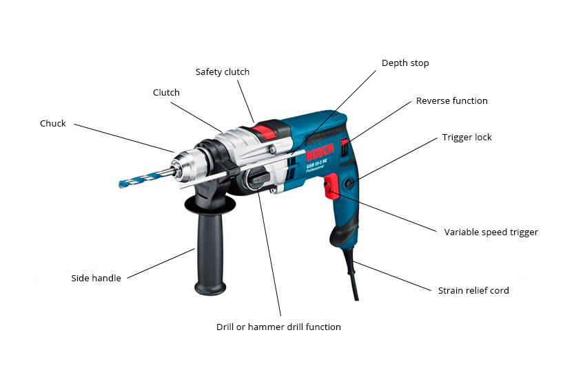

There's this interesting idiom in English:

> to miss the forest for the trees.

From the [Merriam-Webster dictionary](https://www.merriam-webster.com/dictionary/miss%20the%20forest%20for%20the%20trees):
_to not understand or appreciate a larger situation, problem, etc., because one is considering only a few parts of it._

I think this idea translates very well to problem-solving. Sometimes we fail to see the big picture because you're trapped
on the small details. Let's consider for example the case of algorithm coding problems.

# Algorithm coding problems

Whether you agree with solving these as part of a hiring process is beyond the point of this article. But if
you visit a website like [Leet Code](https://leetcode.com/) or [HackerRank](https://www.hackerrank.com/) you can easily
spot that there are multiple categories of problems.

There are problems with trees, graphs, sliding windows, etc. Each of these categories represent a sets of
problems which you can solve by applying a certain algorithm.

These algorithms are, at the highest level, the main tool you're going to use to solve a problem.
It is only natural that first you need to have these tools on your tool belt to be able to use them.

# Your Tool belt

Knowing when to use an algorithm and knowing how to implement it should be the first step.
That seems kinda obvious, right?
But, the point is that if you're solving a sliding window problem, creating a sliding window, needs to be trivial for you.

It can be really frustrating to forget about a certain check, or getting some kind of out of bounds exception because
you can't remember what a sliding window looks like.
When you're solving a problem, a sliding window has to be just a tool. When you decide to use it, it's gotta be ready to go.

# Knowing your tool

The other thing is understanding how to use that tool. Think of it as just any other tool... like a drill.
It's got some buttons and some switches that can alter its behavior. You can also use different bits depending on surface.

Having a drill by itself is not enough. You have to know what can be changed or configured on it for
different scenarios.

 a drill 

For example, a sliding window can have a dynamic, or static width.
Or maybe you need to keep track of different things while you're moving across the dataset. Knowing how to work with
the tool is key.

# Sharpening your tool

The next thing is the language and its data structures and idioms. You have to be comfortable with the language 
that you're going to work with. Compilation errors shouldn't catch off guard you. You have to make sure that you 
know how to use its data types. Working with Arrays, and maps should really not be a problem.

# Planning and Zooming

If you have these out of the way, then you can really focus on what the problem is about. 
In my experience, ideally you should to have a plan before you start coding. Drawing, sketching, writing, etc
are all useful at this point.
This way you can piece together each part of the idea and gradually zoom in, from the bigger picture, to the small details
of the implementation. 

Then, you can validate your assumptions at each step of the way:
- Is my sliding window iterating over the dataset correctly?
- Is this validation correct?
- Is the content of that data structure correct? 

But, if you start having issues with your sliding window implementation because you forgot how to keep track of the
pointers, or if compilation errors keep popping up, or you can't add new items to your hash-map, 
then this will take up your energy, and you won't be able to be to focus on the actual problem-solving.

Since you can only keep a certain amount of subjects in your working memory, it's important to use it efficiently.
Avoiding constant changes in this zoom level helps to manage the amount of information you're going to have to work with.

# Wrap up - Keeping the forest in sight

Keeping context switching to a minimum is a key part of problem-solving for me. I usually trip over myself
when I'm trying to think through something only to find out that some basic assumptions were wrong. Or if I keep getting 
weird compilation errors, or if my hash-map is not working as I thought. 
When you start to jump around fixing different parts of the implementation, at different "zoom levels", 
you lose sight of the forest. For that reason, *when studying*, I think it's important to check each of these stages 
before jumping into a problem.
