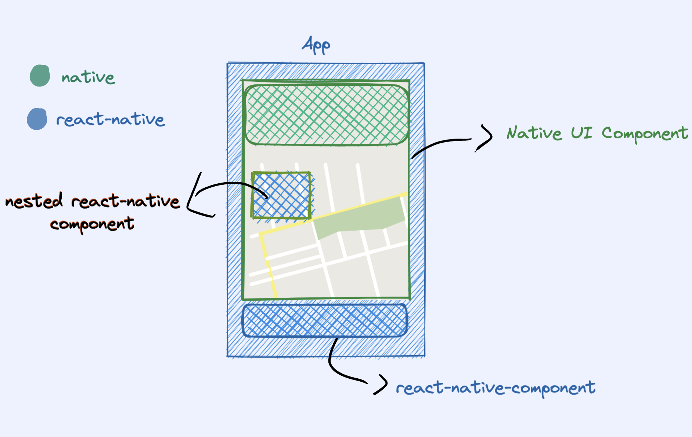
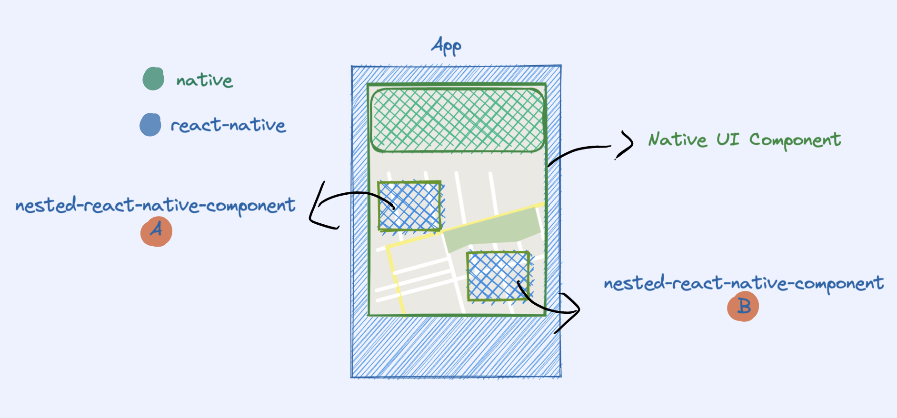

React Native has support for creating Native UI components which are implemented using the native ui frameworks, and 
exposed as react-native components. This is the most common use case, but there's also a not so common one, which 
allows you to nest React Native components inside the native UI.

Now, let's skip the whole discussion about whether you should do that or not. 
Since there's not a lot of info about this on the web, the main point of this article is to give you a brief overview 
of what nesting react components looks like in practice and how to implement that on both platforms.


## Native UI Components in React-native

I'm breaking down this feature in two main use cases:

**Basic Native UI component**

You have a native ui component which can be shown inside a React Native app, side-by-side a react component.

This one is well covered, you can follow the [official docs](https://reactnative.dev/docs/native-components-ios) to 
implement it.

**Nesting React Native components in Native UI**

In addition to the basic use case, this `native-ui` also supports having react components being laid out inside it.

Let's take a second to visualize what we want to build:



So, what are we looking at?
- We have a React Native App which has a `Native UI Component`.
- This `Native UI Component` has a native view, which acts as `slot` in its view hierarchy where we place the `nested react-native component`.
- Finally, we have a simple `React Native Component` as a sibling of the `Native UI Component`.

From the react-native side, this could look like this:

```tsx
import { requireNativeComponent } from 'react-native';

export const YourNativeComponent = requireNativeComponent('YourNativeComponent');

const App: () => JSX.Element = () => {
  return (
    <View>
      <YourNativeComponent>
        <View nativeID="aWildNativeID">
          <Button title="Nested React native Button" />
        </View>
      </YourNativeComponent>
      <Button title="React native Button" />
    </View>
  );
};
```

We'll revisit this later, but for now, let's take a look at the native code.

## Native Changes

Let's quickly go over the basic building blocks of native-ui integration with react.

On **android** we have the `ViewGroupManager` class, which you need to extend from to create a native ui component.

```kotlin
class YourNativeComponentManager : ViewGroupManager<YourComponentView>() {

	override fun createViewInstance(context: ThemedReactContext): FrameLayout {
	  return YourComponentView(context)
	}

	override fun addView(parent: FrameLayout?, child: View?, index: Int) {
  	  TODO("Add child to view hierarchy")
	}

	override fun getName() = "YourNativeComponent"

	// ...
}
```

On **iOS** that looks a bit different:

```swift
@objc(YourNativeComponentManager)
public class YourNativeComponentManager: RCTViewManager {
    public override func view() -> UIView! {
        return YourNativeComponentView()
    }
}

public class YourNativeComponentView: UIView {
    public override func insertReactSubview(_ subview: UIView!, at atIndex: Int) {
		// TODO: add subview to view hierarchy
    }
}
```

When the react-native side starts nesting components, as we showed before, you'll start receiving calls to the
`addView` method on **android** and to the `insertReactSubview` on **iOS**. 

These methods will allow you to actually lay out the views on your component's view hierarchy.

## Advanced Layout Strategy

If you plan to nest multiple kinds of components in different places of your view, you will need to change things a bit.

Imagine you have `react-component A` and a `react-component-B` and they need to be placed in different places in your 
view hierarchy.



When `addView` or `insertReactSubview` are called, you'll just get a new view, and you have to do something with it (put it somewhere).

### Identifying react subviews:

To identify each view, you can tag them on the react-native side with the `nativeID` property.

This way, when you get that view on the native side, you can use that to figure out where should you place it.


On **android**, you need to use the react's android library to do that via the
`ReactFindViewUtil.findView(view, "nativeId")`. It will help you identify if a particular view has the 
given `nativeID`.

On **iOS** that's a bit easier. You have access to the view's `nativeID` directly via `subview.nativeID` property.

### Laying Them Out:

To lay out these components accordingly, what I suggest is limiting them to a slot on your native implementation. 
This way, the native side can stay in control of its own ui. You assign each of these possible subviews a slot on 
your view hierarchy.

